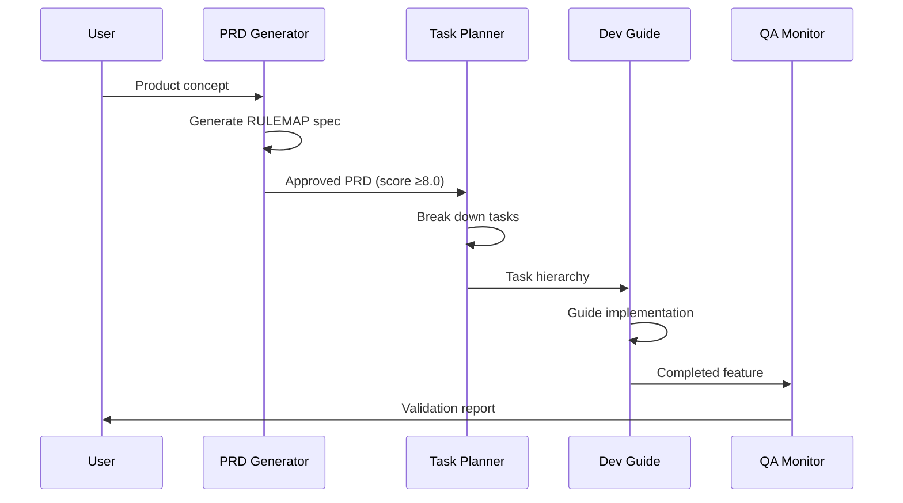
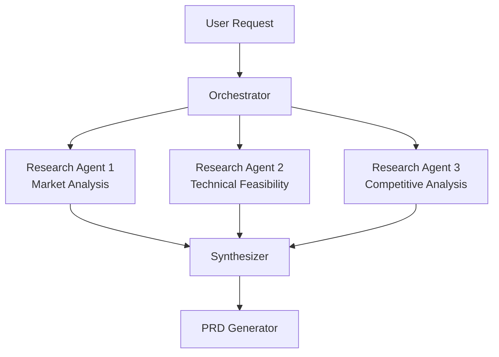
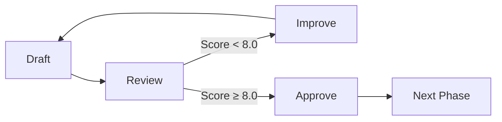

# SpecMap Universal AI Skills Architecture
## Strategic Framework for Multi-Platform Capabilities

**Date**: 2025-12-23
**Version**: 1.0
**Status**: Strategic Planning Document

---

## Executive Summary

SpecMap has an opportunity to become the **universal spec-driven development platform** by creating a skills architecture that automatically leverages the native capabilities of whatever AI model a developer is using.

### The Vision

```
┌────────────────────────────────────────────────────────────────────┐
│                      SpecMap Universal Core                        │
│  ┌─────────────┐  ┌─────────────┐  ┌─────────────┐               │
│  │ SPECMAP.md  │  │features.json│  │ progress.md │               │
│  │   (Rules)   │  │  (Intent)   │  │ (Heartbeat) │               │
│  └─────────────┘  └─────────────┘  └─────────────┘               │
│                         │                                         │
│           ┌─────────────┴─────────────┐                          │
│           │    Platform Adapter Layer  │                          │
│           └─────────────┬─────────────┘                          │
└─────────────────────────┼──────────────────────────────────────────┘
                          │
    ┌─────────────────────┼─────────────────────┐
    │                     │                     │
    ▼                     ▼                     ▼
┌─────────┐         ┌─────────┐         ┌─────────┐
│ Claude  │         │ ChatGPT │         │ Gemini  │
│  Code   │         │  + GPTs │         │  CLI    │
├─────────┤         ├─────────┤         ├─────────┤
│• Skills │         │• Custom │         │• Gems   │
│• MCP    │         │  GPTs   │         │• Exts   │
│• Hooks  │         │• Agent  │         │• Opal   │
│• Subagnt│         │  Mode   │         │• MCP    │
└─────────┘         └─────────┘         └─────────┘
```

---

## Part 1: Platform Capability Mapping

### Claude Code / Claude.ai Ecosystem

| Capability | Description | SpecMap Integration |
|------------|-------------|---------------------|
| **Skills** | Modular expertise packages with SKILL.md, scripts, references, assets | Package SpecMap as distributable .skill |
| **MCP Servers** | Model Context Protocol for tool connectivity | Connect to Jira, GitHub, Slack, databases |
| **Subagents** | Isolated parallel execution with context isolation | PRD Agent, Task Agent, QA Agent specialization |
| **Hooks** | Pre/post operation automation | Auto-format, quality gates, notifications |
| **Slash Commands** | User-triggered repeatable workflows | `/specify`, `/clarify`, `/plan`, `/tasks` |
| **CLAUDE.md** | Project-specific context and rules | SpecMap rules and conventions |
| **Built-in Skills** | docx, pptx, xlsx, pdf, frontend-design | Professional deliverable generation |

**Key Recent Developments** (Dec 2025):
- Skills now published as open standard for cross-platform portability
- Programmatic Tool Calling for code-based orchestration
- Tool Search Tool for dynamic discovery (85% token reduction)
- Advanced agent orchestration with DAA (Dynamic Agent Architecture)

### ChatGPT / OpenAI Ecosystem

| Capability | Description | SpecMap Integration |
|------------|-------------|---------------------|
| **Custom GPTs** | Tailored AI assistants with custom instructions | SpecMap PRD Generator GPT, Task Planner GPT |
| **GPT Store** | Marketplace for GPT distribution | Publish SpecMap GPTs publicly |
| **Projects** | Workspace organization with files and context | SpecMap project workspace template |
| **Agent Mode** | Autonomous task execution (Operator integration) | Automated research, task execution |
| **Canvas** | Collaborative editing interface | PRD drafting and refinement |
| **MCP Connectors** | Atlassian, Salesforce, etc. | Same connectivity as Claude |
| **Deep Research** | Multi-page synthesis reports | Market analysis, competitive research for PRDs |
| **GPT-5 Thinking** | Advanced reasoning modes | Complex requirement analysis |

**Key Recent Developments** (Dec 2025):
- ChatGPT Agent fully integrated (Operator sunset)
- GPT-5.2 for Enterprise with improved artifact creation
- Connectors enable external tool access
- Real-time collaboration features

### Google Gemini Ecosystem

| Capability | Description | SpecMap Integration |
|------------|-------------|---------------------|
| **Gems** | Customized AI experts for specific tasks | SpecMap Gems for each workflow phase |
| **Gemini CLI Extensions** | Command-line tool integrations | `gemini extensions install specmap` |
| **Opal** | Vibe-coding for mini-app creation | Generate SpecMap dashboards/tools |
| **Deep Research** | Comprehensive research synthesis | Requirements research, competitive analysis |
| **Extensions** | Google Workspace, third-party connections | Drive, Sheets, Docs integration |
| **Workspace Integration** | Native Gmail, Docs, Sheets access | PRD drafts in Docs, tracking in Sheets |

**Key Recent Developments** (Dec 2025):
- Gemini CLI Extensions framework launched (Oct 2025)
- Opal integration for creating mini-apps
- Gemini 3 Pro rolling out
- MCP support via extensions

---

## Part 2: Unified Skills Architecture

### Core Principle: Write Once, Adapt Everywhere

```
specmap/
├── core/                          # Platform-agnostic core
│   ├── SPECMAP.md                 # Rules and methodology
│   ├── features.json              # Intent tracking schema
│   ├── progress.md                # Heartbeat format
│   └── templates/                 # Universal templates
│       ├── specification.md
│       ├── plan.md
│       ├── tasks.md
│       └── tracking.md
│
├── skills/                        # Modular capabilities
│   ├── document-generation/       # docx, pptx, xlsx, pdf
│   ├── agent-orchestration/       # Multi-agent coordination
│   ├── quality-assurance/         # RULEMAP scoring, validation
│   ├── integration/               # External tool connectivity
│   └── visualization/             # Dashboards, reports
│
├── platforms/                     # Platform-specific adapters
│   ├── claude/                    # Claude Code / Claude.ai
│   │   ├── .claude/
│   │   │   └── commands/          # Slash commands
│   │   ├── skills/                # .skill packages
│   │   ├── mcp/                   # MCP server configs
│   │   └── CLAUDE.md              # Project instructions
│   │
│   ├── chatgpt/                   # ChatGPT / OpenAI
│   │   ├── gpts/                  # Custom GPT definitions
│   │   │   ├── specmap-prd-generator.json
│   │   │   ├── specmap-task-planner.json
│   │   │   └── specmap-qa-monitor.json
│   │   ├── projects/              # Project templates
│   │   └── prompts/               # System prompts
│   │
│   ├── gemini/                    # Google Gemini
│   │   ├── gems/                  # Gem definitions
│   │   ├── extensions/            # CLI extensions
│   │   └── workspace/             # Google Workspace templates
│   │
│   └── n8n/                       # Workflow automation
│       ├── workflows/             # Pre-built workflows
│       └── nodes/                 # Custom node configs
│
└── shared/                        # Cross-platform resources
    ├── schemas/                   # JSON schemas for validation
    ├── examples/                  # Universal examples
    └── docs/                      # Platform-agnostic docs
```

---

## Part 3: Skill Definitions by Platform

### 3.1 Claude Skills Package

#### Core SpecMap Skill
```yaml
# skills/specmap-core/SKILL.md
---
name: specmap-core
description: "Specification-driven development system using RULEMAP framework. 
  Triggers on: project initialization, PRD creation, task breakdown, progress 
  tracking, quality scoring. Use when developers need structured requirements, 
  implementation planning, or project management with AI assistance."
---

# SpecMap Core Skill

## Quick Start
1. Initialize: Create SPECMAP.md, features.json, progress.md
2. Specify: Generate RULEMAP-enhanced specifications
3. Plan: Create implementation plans with technical decisions
4. Tasks: Break down into TDD-ready task lists
5. Track: Update progress with comprehensive ID system

## Workflows
See references/ for detailed workflow documentation.

## Integration
- Document generation: See ../document-generation/SKILL.md
- Agent orchestration: See ../agent-orchestration/SKILL.md
- Quality assurance: See ../quality-assurance/SKILL.md
```

#### Document Generation Skill
```yaml
# skills/document-generation/SKILL.md
---
name: specmap-documents
description: "Generate professional deliverables from SpecMap data.
  Creates: Word PRDs, Excel dashboards, PowerPoint presentations, PDF reports.
  Triggers on: 'export', 'generate report', 'create presentation', 'dashboard'."
---

# Document Generation

## Capabilities
- **docx**: PRDs with tracked changes, stakeholder review docs
- **xlsx**: Project dashboards with live formulas, tracking spreadsheets
- **pptx**: Kickoff decks, sprint reviews, stakeholder presentations
- **pdf**: Final reports, audit trails, contract deliverables

## Usage
1. Ensure SpecMap data exists (SPECMAP.md, features.json, progress.md)
2. Call appropriate skill for output format
3. Follow skill-specific instructions for best results

## References
- docx workflow: See /mnt/skills/public/docx/SKILL.md
- xlsx workflow: See /mnt/skills/public/xlsx/SKILL.md
- pptx workflow: See /mnt/skills/public/pptx/SKILL.md
- pdf workflow: See /mnt/skills/public/pdf/SKILL.md
```

#### Agent Orchestration Skill
```yaml
# skills/agent-orchestration/SKILL.md
---
name: specmap-agents
description: "Multi-agent orchestration for SpecMap workflows. Coordinates
  specialized agents: PRD Generator, Task Planner, Development Guide, QA Monitor.
  Triggers on: 'agent', 'orchestrate', 'coordinate', 'handoff', 'parallel work'."
---

# Agent Orchestration

## Agent Roles

### PRD Generator Agent
- **Focus**: Requirements analysis, RULEMAP specification
- **Inputs**: Product concept, stakeholder input
- **Outputs**: Complete PRD with RULEMAP score ≥8.0
- **Handoff**: To Task Planner when PRD approved

### Task Planner Agent  
- **Focus**: Implementation breakdown, dependency mapping
- **Inputs**: Approved PRD, codebase analysis
- **Outputs**: Task hierarchy with estimates and dependencies
- **Handoff**: To Development Guide when plan approved

### Development Guide Agent
- **Focus**: Implementation guidance, code review
- **Inputs**: Task list, technical context
- **Outputs**: Completed tasks, quality feedback
- **Handoff**: To QA Monitor on feature completion

### QA Monitor Agent
- **Focus**: Quality validation, RULEMAP scoring
- **Inputs**: Completed implementation
- **Outputs**: Validation report, deployment readiness

## Orchestration Patterns
See references/orchestration-patterns.md for:
- Sequential handoffs
- Parallel execution
- Context isolation
- Error recovery
```

### 3.2 ChatGPT Custom GPTs

#### SpecMap PRD Generator GPT
```json
{
  "name": "SpecMap PRD Generator",
  "description": "AI-powered PRD creation using RULEMAP framework",
  "instructions": "You are an expert product manager specializing in RULEMAP-structured requirements. Guide users through creating comprehensive PRDs covering: Role & Authority, Understanding & Objectives, Logic & Structure, Elements & Specifications, Mood & Experience, Audience & Stakeholders, Performance & Metrics. Score each section and iterate until achieving ≥8.0 overall.",
  "conversation_starters": [
    "Help me create a PRD for a new feature",
    "Review and improve my existing PRD",
    "What RULEMAP sections am I missing?",
    "Score my PRD against RULEMAP criteria"
  ],
  "capabilities": {
    "web_browsing": true,
    "code_interpreter": true,
    "file_upload": true
  },
  "knowledge_files": [
    "rulemap-framework.md",
    "prd-template.md",
    "scoring-rubric.md"
  ]
}
```

#### SpecMap Task Planner GPT
```json
{
  "name": "SpecMap Task Planner",
  "description": "Transform PRDs into actionable implementation plans",
  "instructions": "You are an expert technical architect who breaks down PRDs into implementable tasks. Analyze requirements, identify dependencies, estimate effort, and create TDD-ready task hierarchies. Use the tracking ID system (XXX-T-XXX format) for all tasks. Consider parallel execution opportunities and critical path.",
  "conversation_starters": [
    "Break down this PRD into tasks",
    "Identify dependencies in my task list",
    "Estimate effort for these requirements",
    "Suggest parallel execution groups"
  ],
  "capabilities": {
    "code_interpreter": true,
    "file_upload": true
  },
  "knowledge_files": [
    "task-breakdown-methodology.md",
    "tracking-id-system.md",
    "estimation-guidelines.md"
  ]
}
```

### 3.3 Gemini Gems

#### SpecMap Specification Gem
```yaml
name: "SpecMap Spec Writer"
description: "Create RULEMAP-structured specifications"
instructions: |
  You are a specification expert using the RULEMAP framework.
  
  When helping with specifications:
  1. Always structure content using RULEMAP elements
  2. Score each section (0-10) and note improvement areas
  3. Flag [NEEDS CLARIFICATION] for ambiguous requirements
  4. Ensure acceptance criteria are testable
  5. Target overall score ≥8.0 before proceeding
  
  RULEMAP Elements:
  - R: Role & Authority
  - U: Understanding & Objectives  
  - L: Logic & Structure
  - E: Elements & Specifications
  - M: Mood & Experience
  - A: Audience & Stakeholders
  - P: Performance & Metrics
  
anchored_files:
  - specmap-prd-template.md
  - rulemap-scoring-guide.md
```

#### SpecMap Dashboard Gem
```yaml
name: "SpecMap Dashboard"
description: "Create project tracking visualizations"
instructions: |
  You are a project dashboard specialist who creates:
  - Progress visualizations
  - RULEMAP score gauges
  - Task completion metrics
  - Timeline/milestone tracking
  - Risk and blocker summaries
  
  Use Google Sheets formulas (not hardcoded values) for:
  - Completion percentages
  - Score calculations
  - Date-based metrics
  
  Output formats: Google Sheets, interactive HTML, or reports.
```

### 3.4 Gemini CLI Extension

```yaml
# gemini-specmap-extension/manifest.yaml
name: specmap
version: "1.0.0"
description: "SpecMap specification-driven development for Gemini CLI"

tools:
  - name: specmap_init
    description: "Initialize a new SpecMap project"
    parameters:
      project_name: string
      project_type: enum[web-app, mobile-app, api, library]
      
  - name: specmap_specify
    description: "Create or update a feature specification"
    parameters:
      feature_description: string
      feature_id: string (optional)
      
  - name: specmap_plan
    description: "Generate implementation plan from specification"
    parameters:
      feature_id: string
      
  - name: specmap_tasks
    description: "Break down plan into TDD tasks"
    parameters:
      feature_id: string
      parallel_groups: boolean
      
  - name: specmap_track
    description: "Update and view progress"
    parameters:
      action: enum[status, update, report]
      item_id: string (optional)

context_files:
  - path: "references/specmap-methodology.md"
    description: "Core SpecMap methodology and RULEMAP framework"
  - path: "references/tracking-system.md"
    description: "Tracking ID system documentation"
```

---

## Part 4: Cross-Platform MCP Integration

### Shared MCP Servers

These MCP servers work across Claude, ChatGPT (via connectors), and Gemini CLI:

```yaml
# mcp/specmap-mcp-server/config.yaml
name: specmap-mcp
version: "1.0.0"
transport: stdio

tools:
  # Project Management
  - name: search_specmap_items
    description: "Search tasks, requirements, questions by ID, type, or status"
    
  - name: get_feature_status
    description: "Get complete status of a feature including all items"
    
  - name: create_specmap_item
    description: "Create new task, question, decision, or issue"
    
  - name: update_task_status
    description: "Update status of a task (Pending → In Progress → Complete)"
    
  - name: list_sprint_tasks
    description: "List all tasks in current sprint"
    
  - name: get_session_summary
    description: "Get summary of recent session activity"

  # External Integrations
  - name: sync_to_jira
    description: "Sync SpecMap tasks to Jira tickets"
    
  - name: sync_to_github
    description: "Create GitHub issues from SpecMap tasks"
    
  - name: notify_slack
    description: "Send status updates to Slack channel"

resources:
  - name: project_state
    description: "Current project state from SPECMAP.md"
    uri: "specmap://state"
    
  - name: feature_list
    description: "List of all features from features.json"
    uri: "specmap://features"
```

### Platform-Specific MCP Usage

| Platform | MCP Integration Method |
|----------|------------------------|
| Claude Code | Native MCP client in settings.json |
| Claude.ai | MCP via connectors (Enterprise) |
| ChatGPT Enterprise | MCP Connectors in Admin Settings |
| Gemini CLI | MCP via extensions framework |
| n8n | MCP nodes or HTTP/webhook integration |

---

## Part 5: Agent Orchestration Patterns

### Pattern 1: Sequential Handoff (Default)



### Pattern 2: Parallel Research



### Pattern 3: Iterative Refinement



---

## Part 6: Implementation Roadmap

### Phase 1: Foundation (Weeks 1-2)
**Goal**: Core skills package for Claude Code

- [ ] Create specmap-core skill with SKILL.md
- [ ] Create document-generation skill
- [ ] Create agent-orchestration skill
- [ ] Package as distributable .skill files
- [ ] Test with Claude Code projects

**Deliverables**:
- `specmap-core.skill`
- `specmap-documents.skill`
- `specmap-agents.skill`

### Phase 2: ChatGPT Integration (Weeks 3-4)
**Goal**: Custom GPTs and project templates

- [ ] Create PRD Generator GPT
- [ ] Create Task Planner GPT
- [ ] Create QA Monitor GPT
- [ ] Create Project template with files
- [ ] Submit to GPT Store (optional)

**Deliverables**:
- 3 Custom GPTs with knowledge files
- Project template package

### Phase 3: Gemini Integration (Weeks 5-6)
**Goal**: Gems and CLI extension

- [ ] Create SpecMap Gems (Spec Writer, Planner, Dashboard)
- [ ] Build Gemini CLI extension
- [ ] Test with Gemini CLI
- [ ] Publish extension to ecosystem

**Deliverables**:
- Gem definitions
- `gemini-specmap-extension`

### Phase 4: MCP Unification (Weeks 7-8)
**Goal**: Cross-platform MCP server

- [ ] Build specmap-mcp-server
- [ ] Test with Claude, ChatGPT, Gemini
- [ ] Add external integrations (Jira, GitHub, Slack)
- [ ] Document configuration per platform

**Deliverables**:
- `specmap-mcp-server` npm package
- Platform configuration guides

### Phase 5: Advanced Orchestration (Weeks 9-12)
**Goal**: Multi-agent coordination

- [ ] Implement subagent patterns for Claude
- [ ] Create ChatGPT Agent Mode workflows
- [ ] Build Gemini Opal mini-apps for dashboards
- [ ] Test cross-platform agent handoffs

**Deliverables**:
- Orchestration playbooks
- Interactive dashboards
- Agent coordination framework

---

## Part 7: Distribution Strategy

### Claude Ecosystem
1. **Skills**: Publish to Claude Skills directory
2. **MCP**: List on MCP server registries
3. **Community**: Share on Claude Code Discord/forums

### ChatGPT Ecosystem
1. **GPT Store**: Submit SpecMap GPTs
2. **Templates**: Share via OpenAI cookbook
3. **Community**: Post on r/ChatGPT, OpenAI forums

### Gemini Ecosystem
1. **Extensions**: Publish to Gemini CLI extensions page
2. **Gems**: Share gem definitions
3. **Workspace**: Create Workspace add-on marketplace listing

### Universal
1. **GitHub**: Open source all adapters
2. **npm**: Publish MCP server
3. **Documentation**: specmap.ai with platform guides

---

## Part 8: Success Metrics

### Adoption Metrics
- Skills/GPTs/Gems downloads/installs
- Active projects using SpecMap
- Community contributions

### Quality Metrics
- Average RULEMAP scores achieved
- Time from concept to PRD completion
- Task breakdown accuracy

### Integration Metrics
- Cross-platform usage patterns
- MCP server connections
- External tool sync success rate

---

## Conclusion

SpecMap has the opportunity to become the **universal standard for spec-driven AI development** by:

1. **Maintaining platform-agnostic core** (SPECMAP.md, features.json, progress.md)
2. **Creating native integrations** for each major AI platform
3. **Leveraging built-in skills** for professional deliverables
4. **Unifying through MCP** for tool connectivity
5. **Enabling agent orchestration** for complex workflows

The key insight is that each platform has its own strengths:
- **Claude**: Deep skills, sophisticated orchestration
- **ChatGPT**: Broad reach, Agent mode, GPT Store
- **Gemini**: Google Workspace integration, CLI for developers

By building adapters for each while keeping the core methodology consistent, SpecMap can serve developers regardless of their AI platform preference.

---

**Next Step**: Start with Phase 1 - Claude Skills package, as this is the most mature skills ecosystem and provides the best foundation for expansion to other platforms.
